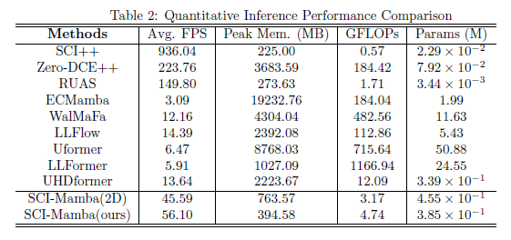
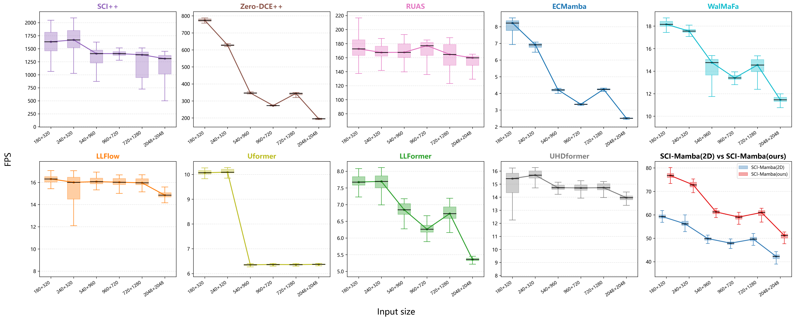
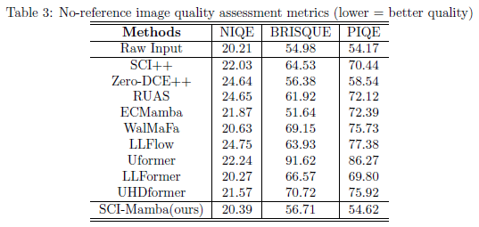

# SCI-Mamba

coming soon

## 🛠️Dependencies and Installation

1.Create a virtual environment
```bash
conda create -n scimamba python=3.8
```

2.Activate the virtual environment
```bash
conda activate scimamba
```

3.Install the required dependencies
```bash
conda install pytorch==1.13.1 torchvision==0.14.1 torchaudio==0.13.1 pytorch-cuda=11.7 -c pytorch -c nvidia
```
```bash
pip install -r requirements.txt
```
Install mamba_ssm：visit the website：https://github.com/state-spaces/mamba/releases
and find mamba_ssm-1.0.1+cu118torch1.13cxx11abiFALSE-cp38-cp38-linux_x86_64.whl
```bash
pip install mamba_ssm-1.0.1+cu118torch1.13cxx11abiFALSE-cp38-cp38-linux_x86_64.whl
```
Install causal-conv1d：visit the website：https://github.com/Dao-AILab/causal-conv1d/releases
and find causal_conv1d-1.0.1+cu118torch1.13cxx11abiFALSE-cp38-cp38-linux_x86_64.whl

Alternatively, you can directly download the .whl file included in this project.
```bash
pip install causal_conv1d-1.0.1+cu118torch1.13cxx11abiFALSE-cp38-cp38-linux_x86_64.whl
```

## 📖Dataset Download
Download Space Dark-1.0 Dataset：
https://pan.baidu.com/s/17qVXFBpyhePKrPgPYJAw5g?pwd=x4q6 
or
https://drive.google.com/file/d/1EZrkjVuEY7ll1MzhZ_qJhwVE5_hybmIf/view?usp=sharing
 

## ⚠️Train&&Test
1.To download datasets training and testing data

2.Change the training set path and epoches,run
```bash
python3 train.py
```

3.Test using pre-trained weights or weights you trained yourself，run
```bash
python3 test.py
```
Download our pre-trained weights:

## 👌Main results
We conduct comprehensive comparative experiments covering three mainstream algorithm families: CNN, Transformer and Mamba. The competing methods include SCI++, Zero-DCE++, RUAS, ECMamba, WalMaFa, LLFlow, Uformer, LLFormer, and UHDformer.




Besides,we adopt three authoritative no-reference image quality metrics without well-exposed orbital ground truth for perceptual evaluation: NIQE, BRISQUE and PIQE . Smaller metric values correspond to less image distortion and more natural visual characteristics.


You can download https://pan.baidu.com/s/1IFWVNG_MZQjhIQSPBdZzRw?pwd=e8yt or https://drive.google.com/file/d/1uDnyMhtyXgB5vUBBpuQlhv6oH1UFiDS9/view?usp=sharing to get these indexes。
